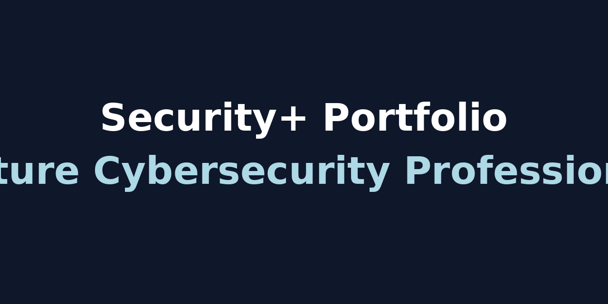

# Security+ Study Portfolio

Welcome to my Security+ Study Portfolio! This repository documents my hands-on labs, study notes, and practice exercises as I prepare for the CompTIA Security+ certification.

---

## 📚 About This Portfolio

This portfolio showcases my learning journey through:
- 🔒 Security+ Domains 1-5
- 🛠️ Hands-on Labs (Practical exercises for real-world skills)
- 📝 Study Notes (Key topics and reflections)
- ✅ Practice Exam Results & Review (Tracking my progress)

---

## 📂 Folder Structure

| Folder    | Contents |
|-----------|----------|
| Labs/     | Step-by-step labs demonstrating practical security skills |
| Notes/    | Domain-specific study notes and key takeaways |
| Practice/ | Coming soon: practice exam scores, notes, and areas to improve |

---

## 🌐 Why This Portfolio?

- 🚀 To document my Security+ preparation for future employers
- 📖 To track my learning and highlight hands-on experience
- 💼 To showcase my commitment to cybersecurity professional growth

---

## 📆 Study Timeline

| Week | Focus Area |
|----|----|
| 1-2 | Domains 1 & 2 - Threats, Attacks, and Architecture |
| 3-4 | Domains 3 & 4 - Implementation and Operations |
| 5-6 | Domain 5 + Full Practice Exams |
| 7-8 | Final Review, Labs, and Mastery Check |

---

## 📊 Practice Exam Tracking

| Exam               | Date Taken | Score | Reflection |
|-------------------|------------|-----|------------|
| ExamCompass Test 1 | TBD | TBD |  |
| Professor Messer 1 | TBD | TBD |  |
| CompTIA Official Practice | TBD | TBD |  |

---

## 💡 About Me 

I’m an aspiring cybersecurity professional with a diverse background that blends military leadership, IT support, and hands-on technical training. After serving as an Executive Officer (XO) and Operations Specialist in a Multi-Role Bridge Company, I developed strong problem-solving skills, attention to detail, and a deep appreciation for operational security.  

Currently, I’m pursuing my CompTIA Security+ certification to formally transition into a cybersecurity role. This portfolio is a reflection of my dedication to continuous learning and my belief that practical, hands-on experience is the best way to master security concepts.

---

## 📈 My Goals

- 🏅 Earn the Security+ certification by Spring 2025.
- 🚀 Pursue roles like Cybersecurity Analyst or SOC Analyst.
- 📚 Build a solid technical foundation for future certifications like CySA+ and beyond.

---

## 💬 Connect With Me

- 🔗 www.linkedin.com/in/lula-ball-7a94201a1
- 📧 Lball597@gmail.com

Thank you for visiting my portfolio and following my journey into cybersecurity! Let’s connect and grow together. 🚀

---

✨ End of README
